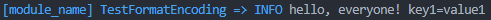
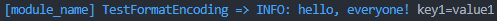
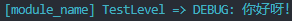

# clogging 包

这个包为区块链平台提供了日志记录器，用于打印日志信息。

## 使用方法

### 定制打印日志格式

**1. 相对来说比较麻烦的方法**

```go
// 1. 首先定义自己喜欢的格式
format := "%{color}[%{module}] %{shortfunc} => %{level}%{color:reset} %{message}"
// 2. 解析格式。
formatters, _ := cenc.ParseFormat(format)
// 3. 获取编码器。
encoder := cenc.NewFormatEncoder(formatters...)
// 4. 创建一个 zap 日志记录器。
core := zapcore.NewCore(encoder, zapcore.AddSync(buf), zap.NewAtomicLevel())
zapLogger := clogging.NewZapLogger(core).Named("module_name").With(zap.String("key1", "value1"))
// 5. 创建 ChainerLogger 日志记录器。
logger := clogging.NewChainerLogger(zapLogger)
// 6. 尝试打印日志。
logger.Info("hello, everyone!")
```

日志打印效果如下图所示：



换一种日志打印格式：

```go
format := "%{color}[%{module}] %{shortfunc} => %{level}: %{message}%{color:reset}"
```

日志打印效果如下图所示：



**2. 简单的方法**

```go
format := "%{color}[%{module}] %{shortfunc} => %{level}: %{message}%{color:reset}"
spec := "debug"

logging, _ := clogging.New(clogging.Config{
	Format: format,
	LogSpec: spec,
	Writer: os.Stdout,
})

zl := logging.ZapLogger("module_name")
cl := clogging.NewChainerLogger(zl)

cl.Debug("你好呀！")
```

日志打印效果如下图所示：

