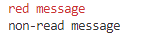
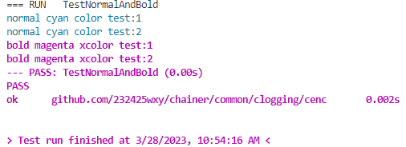
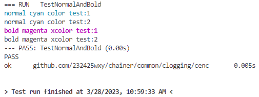

# color.go

## 简介

`color.go` 文件内定义了向控制台输出彩色内容的方法，总共定义了 8 种颜色：
- 黑色：ColorBlack
- 红色：ColorRed
- 绿色：ColorGreen
- 黄色：ColorYellow
- 蓝色：ColorBlue
- 紫红：ColorMagenta
- 青色：ColorCyan
- 白色：ColorWhite

## Color 类型

为了能在代码里调用颜色句柄，`color.go` 文件定义了 `Color` 类型：
```go
type Color uint8
```

`Color` 拥有两种非常简单的方法：`Normal()` 和 `Bold`，其定义如下所示：

**Normal()**
```go
func (c Color) Normal() string {
    return fmt.Sprintf("\x1b[%dm", c)
}
```

**Bold()**
```go
func (c Color) Bold() string {
    return fmt.Sprintf("\x1b[%d;1m", c)
}
```

可以看到，`Normal` 与 `Bold` 方法都可以实现返回彩色的字符串到终端上，不同的地方在于，`Normal` 方法返回的字符串不带加粗效果，而 `Bold` 方法带加粗效果。

实际上，我们想实现往终端上打印彩色内容时，往往是通过以下办法实现的（在终端上打印红色信息）：
```go
fmt.Printf("\x1b[%dmred message\x1b[0m\nnon-read message\n", 31)
```


但是我们发现，不管是 `Normal` 方法还是 `Bold` 方法，它们只包含颜色格式的前半段，即 x1b[%dm 或 \x1b[%d;1m，而后半段 \x1b[0m 则都不包含，这意味着 `Normal` 与 `Bold` 两个方法都有始无终，也就是说，一旦调用了 `Normal` 方法 或者 `Bold` 方法，后面往终端输出的所有内容都将是带彩色或者彩色加粗效果的。例如，我们给出了如下的测试案例：

```go
func TestNormalAndBold(t *testing.T) {
	cyanNormalColor := ColorCyan.Normal()
	fmt.Print(cyanNormalColor)
	fmt.Println("normal cyan color test:1")
	fmt.Println("normal cyan color test:2")

	magentaBoldColor := ColorMagenta.Bold()
	fmt.Print(magentaBoldColor)
	fmt.Println("bold magenta xcolor test:1")
	fmt.Println("bold magenta xcolor test:2")
}
```


那么，如果想重置打印的颜色该怎么办呢？`color.go` 文件提供了一个 `ResetColor()` 方法，该方法实际上就是返回 "\x1b[0m" 字符串的，我们在上述的例子里添加该方法，看看效果是怎样的：
```go
func TestNormalAndBold(t *testing.T) {
	cyanNormalColor := ColorCyan.Normal()
	fmt.Print(cyanNormalColor)
	fmt.Println("normal cyan color test:1")
    fmt.Print(ResetColor())
	fmt.Println("normal cyan color test:2")

	magentaBoldColor := ColorMagenta.Bold()
	fmt.Print(magentaBoldColor)
	fmt.Println("bold magenta xcolor test:1")
    fmt.Print(ResetColor())
	fmt.Println("bold magenta xcolor test:2")
}
```

